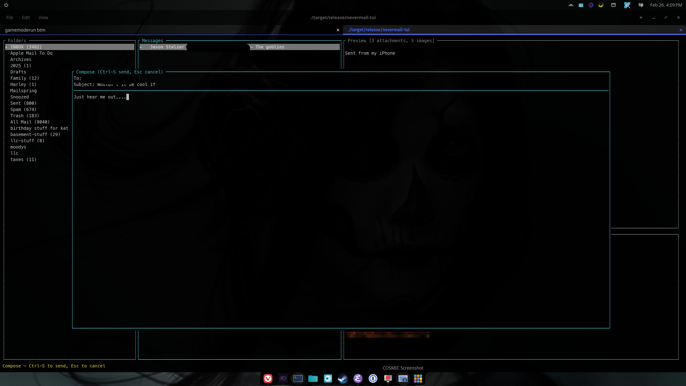
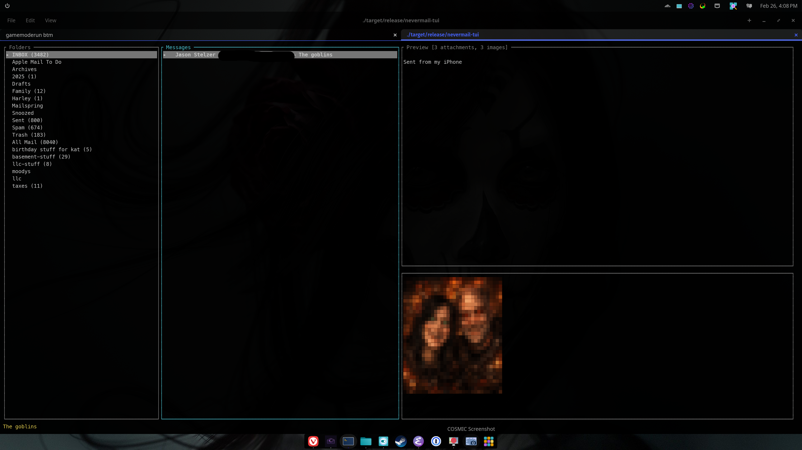
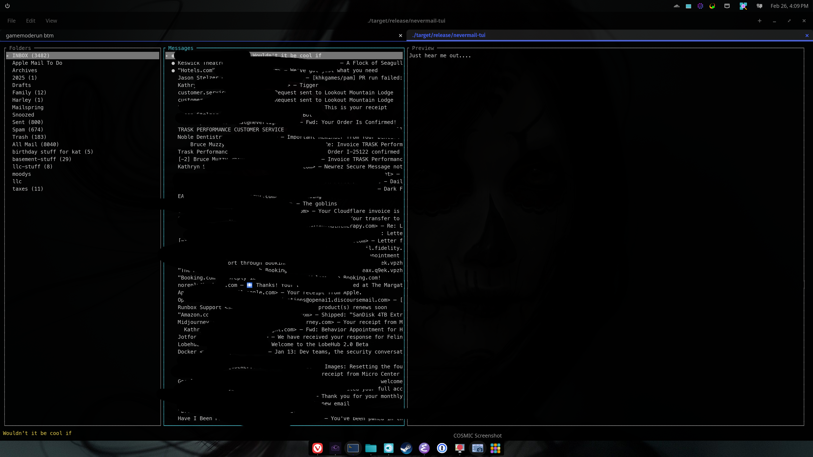

# neverlight-mail-tui

Terminal email client powered by [neverlight-mail-core](https://github.com/neverlight/neverlight-mail-core). Built with [ratatui](https://ratatui.rs/) and [crossterm](https://crates.io/crates/crossterm).

Shares the same email engine, config files, and credential resolution as [neverlight-mail](https://github.com/jstelzer/neverlight-mail) (COSMIC desktop client).





## Features

- Three-pane layout (folders, messages, body preview)
- Mouse support (click to select, scroll wheel navigation)
- Inline image rendering (Sixel, Kitty, iTerm2, halfblocks fallback)
- Multi-account support with instant switching
- SQLite cache for offline reading and instant startup
- IMAP IDLE for live mailbox updates
- Message threading with collapsible threads
- Full-text search (FTS5 via cache)
- Flag operations (read/unread, star)
- Trash and archive
- Compose, reply, and forward with SMTP send
- Body scrolling
- Messages sorted newest-first

## Usage

```bash
# Configure credentials (same env vars as neverlight-mail)
export NEVERLIGHT_MAIL_SERVER=mail.example.com
export NEVERLIGHT_MAIL_USER=you@example.com
export NEVERLIGHT_MAIL_PASSWORD=yourpassword

cargo run
```

Or use a `~/.config/neverlight-mail/config.json` file — see [neverlight-mail-core](https://github.com/neverlight/neverlight-mail-core) for config resolution details.

Multiple accounts are supported. All accounts from config resolution are connected on startup. Press `1`-`9` to switch between them.

## Keybindings

### Navigation

| Key                 | Action                                 |
|---------------------|----------------------------------------|
| `Tab` / `Shift-Tab` | Cycle focus: Folders → Messages → Body |
| `j` / `↓`           | Move down (scroll body when focused)   |
| `k` / `↑`           | Move up (scroll body when focused)     |
| `Enter`             | Open (load messages / view body)       |
| `q`                 | Quit                                   |

### Mouse

| Action       | Effect                                    |
|--------------|-------------------------------------------|
| Click        | Select folder/message, focus pane          |
| Scroll wheel | Navigate folders/messages, scroll body     |

### Message Actions

| Key     | Action                        |
|---------|-------------------------------|
| `s`     | Toggle star                   |
| `R`     | Toggle read/unread            |
| `d`     | Move to Trash                 |
| `a`     | Move to Archive               |
| `Space` | Toggle thread collapse/expand |

### Search

| Key     | Action                        |
|---------|-------------------------------|
| `/`     | Enter search mode             |
| `Enter` | Submit search query           |
| `Esc`   | Cancel search, restore folder |

### Compose

| Key      | Action                           |
|----------|----------------------------------|
| `c`      | Compose new message              |
| `r`      | Reply to selected message        |
| `f`      | Forward selected message         |
| `Ctrl-S` | Send (in compose mode)           |
| `Esc`    | Cancel compose                   |
| `Tab`    | Next field (To → Subject → Body) |

### Multi-Account

| Key     | Action              |
|---------|---------------------|
| `1`-`9` | Switch to account N |


## Layout

```
┌──────────┬───────────────────┬────────────────────────┐
│ Folders  │ Messages          │ Preview [2 att, 1 img] │
│          │                   │                        │
│ INBOX(3) │ ● ★ From — Subj  │ Message body text...   │
│ Sent     │   [-3] From — Re: │                        │
│ Drafts   │     From — Re:   ├────────────────────────┤
│ Trash    │     From — Re:   │ ┌────────────────────┐ │
│ Archive  │   From — Subj    │ │  (inline image)    │ │
│          │                   │ └────────────────────┘ │
└──────────┴───────────────────┴────────────────────────┘
 Status bar / Search: query_
```

## Architecture

```
src/
├── main.rs      — Terminal setup/restore, async event loop (tokio::select!)
├── app.rs       — App state, IMAP/cache/SMTP integration, key handling
├── compose.rs   — Compose state, quote/forward helpers
└── ui.rs        — Three-pane ratatui layout + compose overlay
```

All IMAP and SMTP operations run as background tasks via `tokio::spawn`, communicating results through an `mpsc` channel. The UI never blocks on network I/O.

Cache provides instant display of previously-seen folders, messages, and bodies while IMAP fetches authoritative data in the background.

## Dependencies

| Crate              | Purpose                                               |
|--------------------|-------------------------------------------------------|
| neverlight-mail-core     | Email engine (IMAP, SMTP, MIME, cache, config)        |
| ratatui            | TUI framework                                         |
| crossterm          | Terminal backend (raw mode, alternate screen, events) |
| ratatui-textarea   | Multiline text editor for compose                     |
| ratatui-image      | Inline image rendering (Sixel, Kitty, iTerm2, halfblocks) |
| image              | Image decoding (PNG, JPEG, GIF, etc.)                 |
| tokio              | Async runtime                                         |
| futures            | Stream utilities (IMAP IDLE)                          |
| anyhow             | Error handling                                        |
| log / env_logger   | `RUST_LOG` logging                                    |


## Terminal matters

Inline image quality depends entirely on what your terminal negotiates with `ratatui-image`. The app auto-detects the best available protocol at startup — same code, very different results:

| Terminal        | Protocol    | Image quality               |
|-----------------|-------------|-----------------------------|
| WezTerm         | Kitty/Sixel | Full-fidelity inline images |
| Kitty           | Kitty       | Full-fidelity inline images |
| iTerm2          | iTerm2      | Full-fidelity inline images |
| COSMIC Terminal | Halfblocks  | Block-based approximation   |
| Most others     | Halfblocks  | Block-based approximation   |
| Ghostty         | Kitty/Sixel | Full-fidelity inline images |


If your images look low-resolution or blocky, your terminal likely does not support an inline image protocol. Try WezTerm, Kitty, or iTerm2 for the full experience.

On iTerm2, inline image rendering uses OSC 1337 and may trigger a one-time permission prompt
(`Allow "<app>" to display inline images`). Choose `Allow` to enable rendering.

## Related

- [neverlight-mail-core](https://github.com/neverlight/neverlight-mail-core) — Headless email engine
- [neverlight-mail](https://github.com/jstelzer/neverlight-mail) — COSMIC desktop email client

## License

MIT OR Apache-2.0
